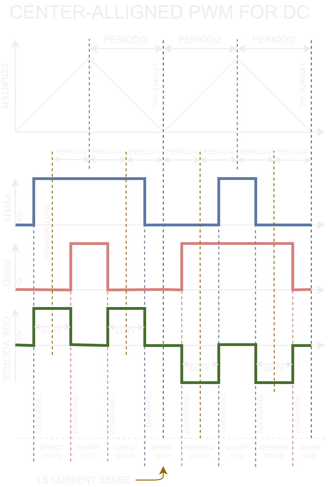

## PWM Driver

This PWM driver works with four PWM channels regardless of the motor type.

The input `sel_motor` provides a duty cycle in normalized `i16` format:

- `[i16::MIN+1 … i16::MAX]` represents a range from 0–100% of the system supply voltage, including the sign (in **ab** coordinates).
- `i16::MIN` is reserved for the inactive state.

The outputs `sel_motor` and `sel_phase`:

- `[0 … i16::MAX]` indicate a duty cycle from 0–100% of the supply voltage. The timer threshold can be calculated easily as: (DUTY << 15) / PERIOD
- `i16::MIN` is reserved for signaling that the system channel is disabled.
- The range `[i16::MIN + 1 … -1]` is reserved for a braking mode, where both switches (transistors) are toggled off to control braking speed.

Because certain duty-cycle algorithms (like SVPWM) rely on a midpoint-based duty ratio, using absolute voltage values is not feasible. It also means that changes in supply voltage require recalculations.

Operating in a normalized data format removes the need for numerous extra checks, as the valid math ranges are known upfront. Additionally, using 16-bit fixed-point arithmetic allows most mathematical operations to be completed in a single cycle without added overhead. Consequently, you can expect an **ab->abcd** conversion with phase correction to take fewer than ~100 microcontroller cycles.

------

## Center-aligned PWM

Since most modern controllers support center-aligned PWM, it makes sense to optimize algorithms specifically for this mode.

**Key Advantages:**

- **Even Component Heating**: Distributes heat across all active switching elements (MOSFET, IGBT).
- **Reduced Peak Currents**: Sequentially engaging power devices can help lower stress on the supply system in multi-phase configurations, reducing high-frequency noise and vibration.
- **Avoiding Zero-Duty Issues**: At extremely low currents, the system does not encounter duty cycles that are too small for MOSFET drivers to handle.

A downside is that these algorithms only work with drivers that provide PWM control for each half-bridge.

### For a DC Motor

In the DC motor case, the duty-cycle calculation is almost trivial, with no branches and only about **5 clock cycles** of execution:

```rust
const MIDPOINT: i16 = i16::MAX >> 1; // Defines the midpoint for PWM alignment
let half_duty = duty / 2;            // Calculates half the duty cycle
let out = (MIDPOINT + half_duty, MIDPOINT - half_duty); // Returns adjusted duty cycle
```

By using `MIDPOINT` as half of the maximum duty (or effectively 50%), no additional computations or branches are needed for determining the voltage direction.

